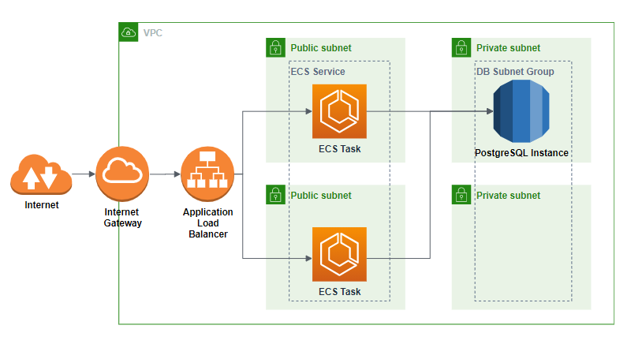

# Servian DevOps Tech Challenge - Tech Challenge App

## Summary
I have very much enjoyed working on this little project. My work experience is primarily with on-prem infrastructure, so I very much enjoyed getting to architect and deploy a cloud application. I learnt a lot in a very short amount of time! Turns out the cloud really does make life easy :)

## Deployment

I have chosen to use an AWS Fargate ECS instance for hosting the dockerized application, and an AWS RDS instance for the postgres. There is an AWS Elastic Load Balancer in front to balnce the multiple fargate tasks.

### Reasons
- AWS Fargate is highly available, and serverless so there is little managing of the containers.
- RDS is a managed database, which is highly available by utilising multiple availability zones, and is easy to scale if required.
- Elastic load balancer allows us to have a single point of entry into the application from the internet. 

## How to Deploy
### Locally
I have created a docker-compose which should allow you to easily run the application locally. The config file for the database is `database.env`. The application config is set in the `conf.toml`.

1. Clone repo
2. `docker-compose up` 

### Deploying to AWS
1. Clone repo, cd into `/deploy`
2. Set environment variable for AWS: 

    `export AWS_ACCESS_KEY_ID = <value>`

    `export AWS_SECRET_ACCESS_KEY= <value>`

3. Run terraform code: 

    `terraform init`

    `terraform apply -var="VTT_DBPASSWORD=changeme" --auto-approve`

3. Push docker image into the newly provisioned AWS ECR instance (Ensure you are authenticated with remote ECR)
 
    `docker build -t servian/techchallengeapp .`

    `docker tag servian/techchallengeapp <path to ECR repo>/ecr_servian:latest`

    `docker push <path to ECR repo>/ecr_servian:latest`

4. Ensure fargate tasks are running successfully. (If the docker image is not uploaded in time, AWS might throttle account on too many failed API calls re-creating the tasks.)

5. Find load balncer DNS name and navigate to site. 

## Architecture Diagram
- RDS Postgres DB deployed in Multi-AZ and Private Subnet
- TechApp deployed as a Fargate Task across multiple AZ's. Can be autoscaled.
- ALB Load Balancer to balance TechApp tasks
- Cloudwatch for app logs

## TODO

There are a lot of things I would implement/change given more time and if this was a real production system.

- Secret Management - using Terraform and AWS Secret Manager to automatically generate and store secret for database. I have simply gone with environment variables for now. (Obviously I wouldn't be storing db passwords in source code config files either.)
- HTTPS
- Makefile for easy tag/push of docker image for local dev.
- CI/CD pipeline to automate the entire deployment. 
- Better logging and observability.

